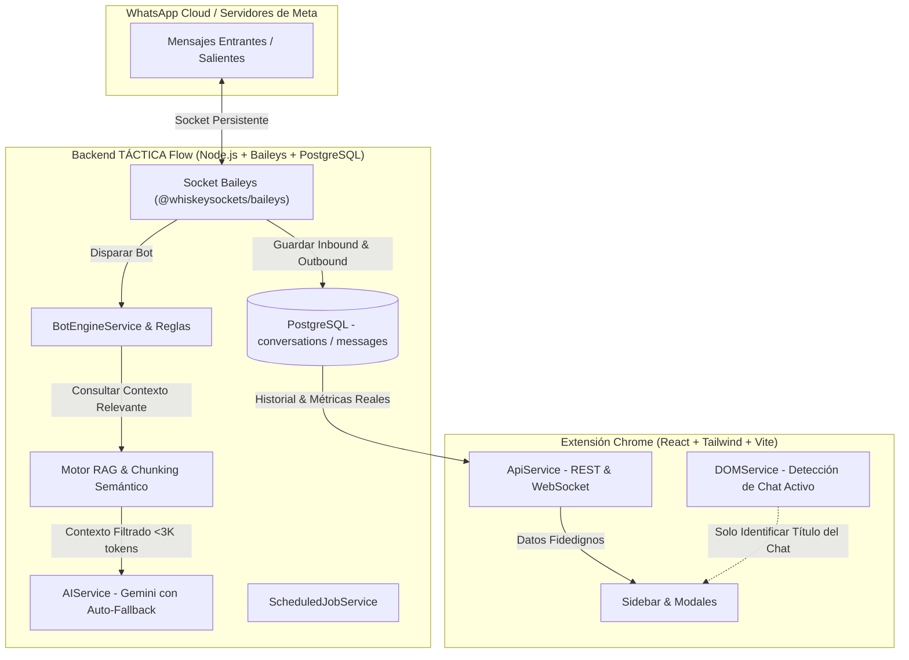

# 🏗️ Arquitectura Integral y Flujo del Sistema: TÁCTICA Flow

Esta documentación consolida todo el diseño técnico, funcionamiento y flujo de datos de **TÁCTICA Flow**, destacando el rol protagónico de **Baileys** como la fuente de verdad (Single Source of Truth) para la persistencia y la inteligencia artificial, reduciendo la dependencia del DOM de WhatsApp Web.

---

## 1. 🧠 Rol de Baileys vs DOM de WhatsApp Web

### ¿Por qué Baileys es la Fuente Primordial?
*   **Virtualización del DOM:** WhatsApp Web en el navegador destruye y virtualiza los mensajes que no están en pantalla para ahorrar memoria RAM. Depender del DOM hace que se pierdan mensajes viejos, fechas exactas y audios.
*   **Baileys mantiene el 100% del historial:** Conectado directamente a los servidores de WhatsApp mediante WebSockets, Baileys recibe y almacena cada mensaje (entrante y saliente) con su marca de tiempo (`createdAt`) milimétrica y fidedigna en PostgreSQL.
*   **Soporte Multidispositivo:** Si el asesor responde desde su teléfono físico o desde WhatsApp Web, Baileys lo detecta (`fromMe: true`) y lo guarda inmediatamente con rol `agent`.

---

## 2. ⚡ Motor de Optimización de Tokens e Inteligencia Artificial (Ahorro ~95%)

Para evitar saturar los límites de cuota (TPM - Tokens por Minuto) de Google AI Studio:

### 1. RAG Ligero (Retrieval-Augmented Generation)
*   **Ubicación:** `backend/src/services/knowledgeBase.service.ts` (`getActiveContext(query)`).
*   **Problema anterior:** Se volcaban cientos de miles de caracteres de todos los PDFs y documentos de la base de conocimiento en cada mensaje (**~100K tokens por consulta**).
*   **Solución implementada:**
    1. Si los documentos suman menos de 14.000 caracteres (~3.500 tokens), se envían directos.
    2. Si superan ese umbral, el sistema **divide los textos en fragmentos semánticos (chunks de 500-700 chars)**.
    3. Extrae palabras clave de la pregunta del usuario (filtrando *stopwords* en español).
    4. Rankea y selecciona únicamente los **2 a 3 fragmentos más relevantes** (máximo ~12.000 chars / ~3.000 tokens).
    5. **Resultado:** Reducción del **95% del consumo de tokens** por mensaje.

### 2. Ventana de Historial Acotada
*   **Ubicación:** `backend/src/services/ai.service.ts`.
*   Se acota a los últimos **8 mensajes (4 turnos de diálogo)** (`conversationHistory.slice(-8)`), evitando que chats antiguos inflen el consumo de tokens.

### 3. Auto-Fallback Inteligente Multimodelo
*   Si un modelo llega a su límite de cuota temporal (`429 Quota Exceeded / ResourceExhausted`), el backend cambia en **600ms** automáticamente al siguiente modelo disponible (`gemini-2.0-flash` o `gemini-1.5-flash`) sin interrumpir la atención del cliente.

### 4. 🔮 Pendiente / idea a futuro: búsqueda semántica en vez de solo por palabra clave
*   **Estado:** No implementado — anotado acá el `2026-08-28` para retomarlo más adelante, no es urgente.
*   **Problema detectado:** `getActiveContext` rankea fragmentos por coincidencia literal de palabras (con ajuste de rareza/IDF y un presupuesto de caracteres generoso agregado el mismo día). Esto funciona bien la mayoría de las veces, pero tiene un techo real: cuando el manual describe algo como una enumeración secuencial (ej. "las 4 solapas de una ventana: Principal, Enlace, Contactos, Plantilla-Reportes"), los últimos ítems de la lista usan palabras muy genéricas (aparecen en decenas de secciones no relacionadas de este manual de 760K caracteres) y terminan puntuando muy bajo — en un caso real, el fragmento correcto quedó en el puesto #268 de 470 fragmentos totales, muy por debajo de lo que cualquier presupuesto de caracteres razonable puede cubrir sin mandarle medio manual a la IA en cada pregunta.
*   **Por qué no alcanza con subir más el presupuesto de contexto:** ya se subió de 16.000 → 40.000 → 80.000 → 120.000 caracteres durante los ajustes de RAG de esta fecha, resolviendo varios casos reales, pero el problema de fondo (matching literal, no por significado) sigue ahí para los casos más extremos.
*   **Solución propuesta:** búsqueda semántica con embeddings.
    1. Generar un embedding (vector) por cada fragmento de cada documento usando la API de embeddings de Gemini (mismo proveedor que ya se usa, sin agregar dependencias nuevas).
    2. Guardar esos vectores en Postgres (columna o tabla nueva) — con solo ~470 fragmentos en la KB actual, ni siquiera hace falta una base de datos vectorial dedicada (pgvector, Pinecone, etc.): un cálculo de similitud coseno directo en el backend es más que suficiente en tiempo y costo.
    3. En cada pregunta, generar el embedding de la consulta y rankear los fragmentos por similitud de significado, idealmente combinado con el ranking por palabra clave actual (híbrido), no como reemplazo total — el matching literal sigue siendo útil para términos técnicos exactos (nombres de módulos, códigos, etc.).
    4. Regenerar embeddings cuando se sube/edita/borra un documento de la base de conocimiento (paso único por documento, no por pregunta).
*   **Estimado de esfuerzo:** del orden de una sesión larga de trabajo (algunas horas), no un proyecto grande — la escala de datos es chica y ya se conoce bien el código de `knowledgeBase.service.ts`.
*   **Trade-off principal:** cada documento nuevo necesita ese paso extra de generar embeddings antes de estar disponible para el bot (costo/latencia única por documento, no por consulta).

---

## 3. 📊 Resúmenes de Conversación con Rangos de Fechas Reales (Baileys)

*   **Ubicación:** `frontend/src/components/sidebar/ai/AiSummaryModal.tsx`.
*   **Opciones de Alcance:**
    *   `Hoy`: Filtra estrictamente los mensajes con `createdAt >= 00:00:00` del día local.
    *   `24h`: Mensajes de las últimas 24 horas (`createdAt >= Date.now() - 24h`).
    *   `7 días`: Mensajes de los últimos 7 días.
    *   `Pantalla`: Mensajes visibles en el DOM actual de WhatsApp Web.
    *   `Todo`: Historial completo almacenado en Baileys.
*   **Conteo Exacto:** Muestra el número real de mensajes analizados (`Resumen (N mensajes analizados)`).
*   **Cero Falsos Positivos:** Si no hubo mensajes hoy, la IA no inventa ni resume mensajes de ayer, sino que informa claramente y ofrece cambiar a "24h" o "7 días" con un solo clic.

---

## 4. 👥 Aislamiento de Contexto en Grupos de WhatsApp

*   **Formato de Clave Única:** En grupos, Baileys almacena las conversaciones bajo el identificador `phone = "<groupJid>-<participantJid>"`.
*   **Beneficio:** Cada persona en el grupo tiene su propio hilo de memoria con la IA. Si Juan pregunta por precios y María por soporte, la IA no confunde los contextos.
*   **Selector de Participantes:** El modal de resumen permite resumir a todo el grupo o a un participante en particular.

---

## 5. 🎨 UI / UX y Modo Oscuro de Alto Contraste

*   Todos los modales (`AiSummaryModal`, `AiAgentConfigModal`, `AiSummaryConfigModal`, `ChatbotModule`) cuentan con estilos adaptados para Dark Mode (`dark:bg-slate-800`, `dark:text-slate-100`, `border-slate-700`), garantizando legibilidad óptima y botones de acción claros.

---

## 6. 📁 Resumen de Archivos Clave del Repositorio

| Módulo | Archivo | Responsabilidad Principal |
| :--- | :--- | :--- |
| **Backend** | `src/services/whatsapp.service.ts` | Conexión WebSocket Baileys, captura de mensajes entrantes y salientes (`fromMe`), emisión por Socket.io. |
| **Backend** | `src/services/conversation.service.ts` | Persistencia en PostgreSQL de conversaciones y mensajes con `createdAt` ISO. |
| **Backend** | `src/services/knowledgeBase.service.ts` | Extracción de documentos (PDF, DOCX, TXT) y motor RAG de fragmentación y ranking por relevancia. |
| **Backend** | `src/services/ai.service.ts` | Integración con Google Gemini, sanitización de modelos, cola anti-ráfaga y auto-fallback 429. |
| **Backend** | `src/services/botEngine.service.ts` | Motor de evaluación de reglas por palabra clave, transferencia humana (`HANDOFF`) y llamada a IA. |
| **Frontend** | `src/components/sidebar/ai/AiSummaryModal.tsx` | Modal de resumen con selector de fechas (Hoy, 24h, 7d, Pantalla, Todo) y conteo real. |
| **Frontend** | `src/services/dom.service.ts` | Identificación del chat activo y lectura auxiliar de mensajes/audios visibles. |
| **Frontend** | `src/services/api.service.ts` | Cliente HTTP centralizado para consumir la API de Baileys, Base de Conocimiento y Gemini. |
